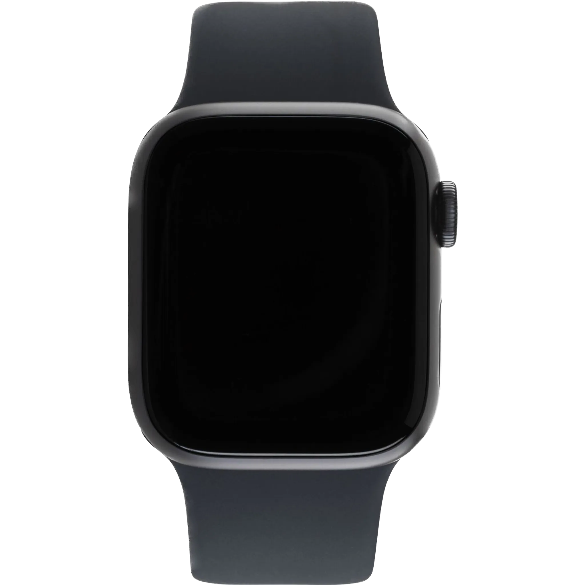

# ADL-recognition-with-wrist-worn-accelerometer

<!-- PROJECT LOGO -->
<br />
<div align="center">
  <a href="https://github.com/erikhelmut/ADL-recognition-with-wrist-worn-accelerometer">
    
  </a>

  <h3 align="center">Enhance our understanding of human actions with neural networks.</h3>

  <p align="center">
    Neural cellular automata (NCA) represent an incredible fusion of neural networks and cellular automata, enabling the simulation of complex systems and showcasing remarkable emergent behavior. NCAs offer a captivating approach to studying and understanding dynamic systems in various fields such as physics, biology, and artificial intelligence, making them truly amazing tools for exploration and discovery.
    <br />
    <a href="https://www.researchgate.net/publication/261415865_Analysis_of_human_behavior_recognition_algorithms_based_on_acceleration_data"><strong>Analysis of human behavior recognition algorithms based on acceleration data »</strong></a>
    <br />  
    <br />
    <a href="https://colah.github.io/posts/2015-08-Understanding-LSTMs/">Understanding LSTM Networks</a>
    ·
    <a href="https://archive.ics.uci.edu/dataset/283/dataset+for+adl+recognition+with+wrist+worn+accelerometer">ADL Dataset</a>
    ·
    <a href="https://www.ml.informatik.tu-darmstadt.de">AIML</a>
  </p>
</div>


<!-- TABLE OF CONTENTS -->
<details>
  <summary>Table of Contents</summary>
  <ol>
    <li>
      <a href="#introduction">Introduction</a>
    </li>
    <li>
      <a href="#getting-started">Getting Started</a>
      <ol>
        <li>
          <a href="#prerequisites">Prerequisites</a>
        </li>
        <li>
          <a href="#installation">Installation</a>
        </li>
      </ol>
    </li>
    <li>
      <a href="#usage">Usage</a>
      <ol>
        <li>
          <a href="#training">Training</a>
        </li>
        <li>
          <a href="#visualizing">Visualizing</a>
        </li>
      </ol>
    </li>
    <li>
      <a href="#contacts">Contacts</a>
    </li>
  </ol>
</details>


<!-- Introduction -->
## Introduction
This repository was created as part of the lecture 'Deep Learning: Architectures & Methods' given by [Prof. Dr. Kristian Kersting](https://www.informatik.tu-darmstadt.de/fb20/organisation_fb20/professuren_und_gruppenleitungen/fb20professuren_und_gruppenleitungen_detailseite_36544.de.jsp) at the [Technical University of Darmstadt](https://www.tu-darmstadt.de/index.en.jsp).

In this project, our primary objective is to enhance our understanding of human actions by utilizing the insights offered by data describing Activities of Daily Living (ADL), with a specific focus on developing a deep learning based model for recognizing human motion primitives using wrist-worn accelerometer data. ADL data holds immense significance as it enables us to monitor and analyze human behavior in real-life scenarios, leading e.g. to a deeper comprehension of human-robot collaboration within our daily environments.

Furthermore, with the rapid advancement of technology, our environments are becoming increasingly intelligent and interconnected. This paradigm shift lays the necessitates for the integration of robotics and smart environments into our lives. By capturing and examining human ADL data, we lay the groundwork for the integration of robotics and smart technologies into our daily routines. This integration holds the potential to significantly enhance the quality of our lives by promoting efficient and effective human-robot cooperation.

By delving deeper into the analysis of human behavior recognition algorithms based on ADL data, our project aims to shed light on the complexities of human actions, leading to a more profound comprehension of our behaviors and facilitating the integration of robotics and smart environments into our everyday lives.


<!-- Getting Started -->
## Getting Started

### Prerequisites
Make sure you have a running Python 3.11+ environment. We recommend using [Anaconda](https://www.anaconda.com/products/individual) for managing your Python environment. 

### Installation

#### Step 1: Clone the repository
```
$ git clone git@github.com:erikhelmut/ADL-recognition-with-wrist-worn-accelerometer.git
$ cd ADL-recognition-with-wrist-worn-accelerometer
```

#### Step 2: Create conda environment
```
$ conda create --name ADLR --file requirements.txt
$ conda activate ADLR
```


<!-- USAGE -->
## Usage
We provide a set of tools for training and visualizing our WISTAR (Wrist-worn Intelligent Sensing for Activity Recognition) model. The following sections describe how to use them in detail.

### Training
To train the WISTAR model, run the following command:
```
$ cd ADL-recognition-with-wrist-worn-accelerometer/src/
$ python3 train.py --config config.yaml
```

You can keep track of the training process with tensorboard. To do so, run the following command in a separate terminal:
```
$ cd ADL-recognition-with-wrist-worn-accelerometer/
$ tensorboard --logdir runs/
```

### Visualizing
To visualize the trained WISTAR model, run the following command:
```
$ cd neural-cellular-automata/src/
$ python3 visualize.py --config config.yaml
```

### Configuration

The ```config.yaml``` file contains the hyperparameters for the model, settings for the dataset generation and specifications for the
visualization process. Feel free to modify the settings to your needs. The following table describes the most important settings:

| Setting | Description |
| --- | --- |
| ```data_path``` | The path to the data. |
| ```train_split``` | The percentage of the data used for training. |
| ```val_split``` | The percentage of the data used for validation. |
| ```seed``` | The seed for the dataset generation. |
| ```run_path``` | The path to the tensorboard logs. |
| ```model_path``` | The path where to save the model. |
| ```input_size``` | The input size of the model. |
| ```hidden_size``` | The hidden size of the model. |
| ```n_layers``` | The number of recurrent layers of the model. |
| ```n_adl``` | The output size of the model. (Number of ADLs) |
| ```batch_size``` | The batch size for training. Default: 1 |
| ```epochs``` | The number of epochs for training. |
| ```learning_rate``` | The learning rate for training. |


<!-- CONTACTS -->
## Contacts
* Merve Bektas - [mervebx3](https://github.com/mervebx3)
* Erik Helmut - [erikhelmut](https://github.com/erikhelmut)
* Darya Nikitina - [mewmiyu](https://github.com/mewmiyu)
* Moritz Meser - [MoritzMeser](https://github.com/MoritzMeser)